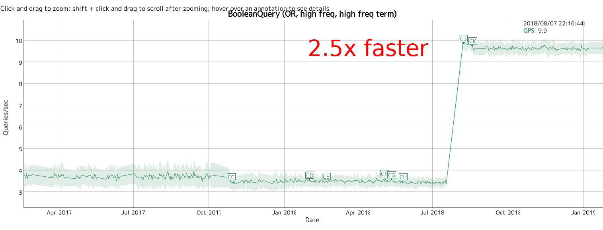
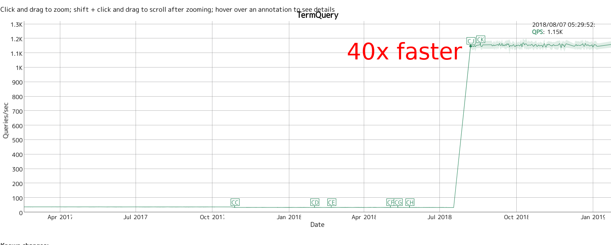
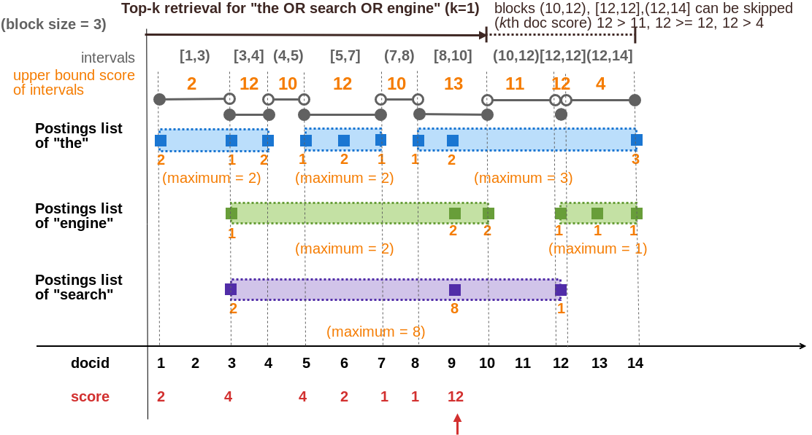
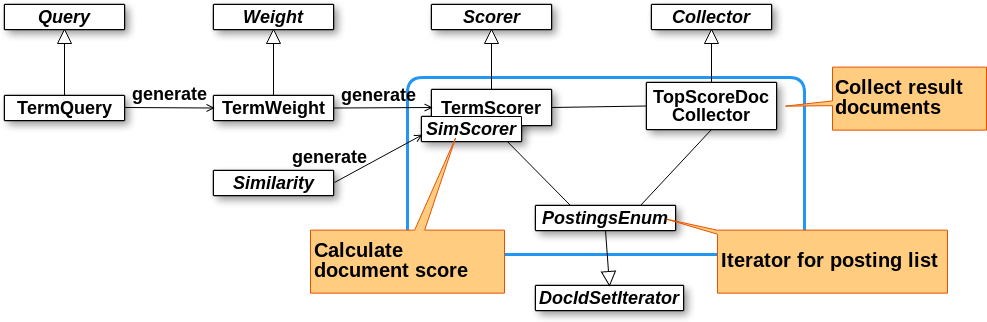
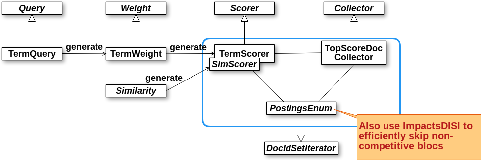
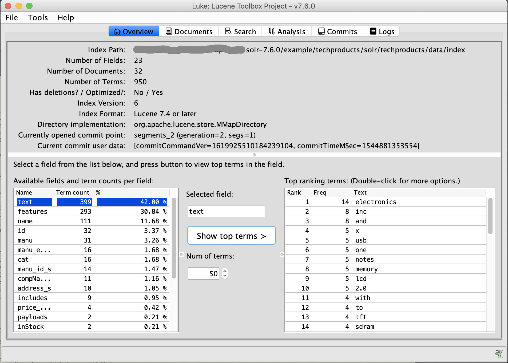

% Efficient top-k query processing in Lucene 8
% Tomoko Uchida 
% 2019/02/26 @ Roppongi Hills

## Who am I 

{width=80}

* Twitter: @moco_beta
* 5+ years of experience w/ Solr and Elasticsearch
* Software Engineer @ [AI Samurai Inc.](https://aisamurai.co.jp/)
* Developing patent search w/ AI technologies 😉
* [Janome](https://mocobeta.github.io/janome/) developer
* [Luke: Lucene Toolbox Project](https://github.com/DmitryKey/luke) co-mainteiner
* [改訂3版 Apache Solr 入門](http://gihyo.jp/book/2017/978-4-7741-8930-7) lead author

----

Lucene/Solr 8.0 and Elasticsearch 7.0 is comming...

## Summary of this talk

* Top-k query processing / scoring will be much faster!
* Especially effective in disjunction (OR) query
* Also works for complex queries such as PhraseQuery, WildcardQuery and their combinations
* Correct total hits count will not be returned (in default)

## And there is a long version...

This talk is a short version of my survey.

Please see this post (in Japanese) for more details :)

[Lucene 8 の Top-k クエリプロセッシング最適化](https://medium.com/@mocobeta/lucene-8-%E3%81%AE-top-k-%E3%82%AF%E3%82%A8%E3%83%AA%E3%83%97%E3%83%AD%E3%82%BB%E3%83%83%E3%82%B7%E3%83%B3%E3%82%B0%E6%9C%80%E9%81%A9%E5%8C%96-1-%E5%B0%8E%E5%85%A5%E7%B7%A8-5a6387076e8e)

## How much faster? - AND query

## How much faster? - OR query (1)

## How much faster? - OR query (2)

## How much faster? - Term query

## References

* [Magic WAND: Faster Retrieval of Top Hits in Elasticsearch](https://www.elastic.co/jp/blog/faster-retrieval-of-top-hits-in-elasticsearch-with-block-max-wand)
* [(FOSDEM 2019) Super-speedy scoring in Lucene 8](https://fosdem.org/2019/schedule/event/super_speedy_scoring_lucene/)
* [(FOSDEM 2019) Apache Lucene and Apache Solr 8](https://fosdem.org/2019/schedule/event/apache_lucene_solr_8/)
* [(Berlin Buzzwords 2012) Efficient Scoring in Lucene](https://vimeo.com/44300228)
* [転置インデックスと Top k-query](https://www.slideshare.net/tsubosaka/top-kquery)

## Papers

* [1] T. Strohman, H. Turtle, and B. Croft.  Optimization strategies for complex queries. In Proceedings of ACM SIGIR conference, 2005.
* [2] K. Chakrabarti, S. Chaudhuri, V. Ganti. Interval-Based Pruning for Top-k Processing over Compressed Lists, in Proc. of ICDE, 2011.
* [3] A. Z. Broder, D. Carmel, M. Herscovici, A. Soffer, J. Y. Zien. Efficient Query Evaluation using a Two-Level Retrieval Process, in Proc. of CIKM, 2003.
* [4] S. Ding and T. Suel. Faster top-k document retrieval using block-max indexes. SIGIR, 2011.

## Algorithms

## Posting list retrieval and the challenge on disjunction

Query "search OR engine"

## MaxScore

- Introduced by H.R.Turtle and J.Flood in 1995

## Interval-based pruning

- MaxScore variant adopted to block compressed indexes [2]

{width=80%}

## WAND

- Special operator proposed in [3]
- "WAND" is the abbreviation for "Week AND" or "Weighted AND"
- OR is being close to AND when a document contains a large enough subset of the query terms
- Score of a document having a large subset of the query terms is higher than the ones of documents with a few of them

## Sounds familiar?

Lucene already has similar concept :

"Minimum Should Match"

## WAND

Query "the OR search OR engine OR lucene"

{width=80%}

## WAND

Steps

1. Assume current threshold (kth highest score) is 12.
2. Sort postings by current pointer.
3. Find "pivot" term and docid - here, that is "search" and id=486.
4. Calculate the partial score for doc 486 if it also contains "the" and "engine".

## Block-max WAND

- WAND variant working with block compressed indexes [4]
- Finally come in Lucene!

## Block-max WAND

{width=80%}

## Dive into Implementation

## Disclaimer

- This is about low-level, complex part of Lucene. Could include mistakes... 🙂
- Lucene API can be rapidly changed. This is based on branch_8_0 branch.

## Review: Lucene scoring architecture

Ex. TermQuery

## Review: Lucene scoring architecture

Ex. BooleanQuery

## Block-max WAND implementation

Changes in indexing

- o.a.l.index.Impact
- o.a.l.codecs.CompetitiveImpactAccumulator
- o.a.l.codecs.lucene50.Lucene50SkipWriter#writeImpacts()
- ...

## Block-max WAND implementation

Changes in retrieving posting list

- o.a.l.codecs.lucene50.Lucene50ScoreSkipReader
- o.a.l.index.ImpactsSource
- o.a.l.search.MaxScoreCache
- o.a.l.search.ImpactsDISI
- ...

## Block-max WAND implementation

Changes in scoring

Ex. TermQuery

## Block-max WAND implementation

Changes in scoring

Ex. BooleanQuery

## [ANN] Luke has been revised!

GUI tool for introspecting and debugging your Lucene/Solr/Elasticsearch index.

<https://github.com/DmitryKey/luke>

{width=50%}

## [ANN] Luke has been revised!

- Eventually rewritten on top of Swing ... in 2019? [It's a long story](https://github.com/DmitryKey/luke/issues/109) :)
- Licenced under ALv2 and works fine with JDK11+
- Popular in US, Europe and China
- Still big growth potential in Japan 🤔

## Thank you 😊

Happy (paper | code) reading!